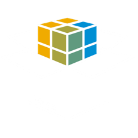

<p align="center"></p>

# MultiApps [](https://travis-ci.org/cloudfoundry-incubator/multiapps)

Provides common components like parsers, validators and utilities for Multitarget Application (MTA) models. These common components are reused across different MTA deployer implementations. One such instance is the [Cloud Foundry MultiApps Controller](https://github.com/cloudfoundry-incubator/multiapps-controller). For more information about the Multitarget Application model, see the official [Multitarget Application Model v.2](https://www.sap.com/documents/2016/06/e2f618e4-757c-0010-82c7-eda71af511fa.html) and the [Multitarget Application Model v.3](https://www.sap.com/documents/2021/09/66d96898-fa7d-0010-bca6-c68f7e60039b.html) specification documents.

# Components

## multiapps-common
Contains different utilities and exception types.

## multiapps-mta
Contains MTA model objects for different specification versions, parsers and validators. 

# Building

*WARNING*: With [Issue 117](https://github.com/cloudfoundry-incubator/multiapps-cli-plugin/issues/117) the master branch of this repository as well as other artifacts will be renamed. Adaptation to any CI/CD infrastructure & scripts will be required.

## Build tools
All components are built with Java 8 and [Apache Maven](http://maven.apache.org/), version `3.3.9` or newer. 

Make sure that your Maven is configured to use Java 8 by configuring the `JAVA_HOME` env to point to the correct Java JDK.
## Compiling and Packaging
To build all components, run the following command from the root directory of the project:
```
$ mvn clean install
```

# How to contribute
* [Did you find a bug?](CONTRIBUTING.md#did-you-find-a-bug)
* [Do you have a question or need support?](CONTRIBUTING.md#do-you-have-a-question-or-need-support)
* [How to develop, test and contribute to MultiApps](CONTRIBUTING.md#do-you-want-to-contribute-to-the-code-base)

# License
Copyright (c) 2020 SAP SE or an SAP affiliate company. All rights reserved.
This file is licensed under the Apache Software License, v. 2 except as noted otherwise in the [LICENSE](https://github.com/cloudfoundry-incubator/multiapps/blob/master/LICENSE) file.
