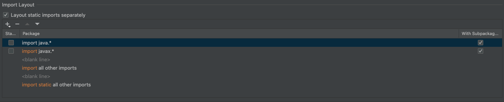

# 🚀 Migration Guide: From Eclipse Formatter Plugin to IntelliJ Native Formatting

This guide helps you transition from the Eclipse Code Formatter plugin to IntelliJ's native formatting system using a shared IntelliJ XML configuration.

---

## ✅ Step 1: Remove the Eclipse Code Formatter Plugin

1. Open IntelliJ IDEA.
2. Go to: `Settings (Preferences on macOS) → Plugins`
3. Search for: `Adapter for Eclipse Code Formatter`
4. Click the down arrow next to Disable and select **"Uninstall"**
5. **Restart IntelliJ** to apply changes.

---

## ✅ Step 2: Import the IntelliJ Code Style XML

1. Go to: `Settings → Editor → Code Style`
2. Click the gear icon ⚙️ next to the scheme dropdown.
3. Select: `Import Scheme → IntelliJ IDEA code style XML`
4. Choose the provided XML file (e.g., `mta_formatter_java.xml`)
5. Click **OK**

---

## ✅ Step 3: Restore IntelliJ Default Import Order

1. Navigate to: `Settings → Editor → Code Style → Java → Imports`
2. In the **Import Layout** section your order should look like the following:

3. Click **Apply** and **OK**

---

## ✅ Step 4: Enable Auto-Formatting and Import Optimization on Save

1. Navigate to: `Settings → Tools → Actions on Save`
2. Enable:
   - ✅ Reformat code
   - ✅ Optimize imports
   - ✅ (Optional) Run code cleanup

---

## ✅ Step 5: Enable "Optimize Imports on the Fly"

1. Go to: `Settings → Editor → General → Auto Import`
2. For Java:
   - ✅ Optimize imports on the fly
   - ✅ Add unambiguous imports on the fly

---

## ✅ Step 6: (Optional) Enable Auto-Save

1. Navigate to: `Settings → Appearance & Behavior → System Settings`
2. Enable:
   - ✅ Save files on frame deactivation
   - ✅ Save files automatically if application is idle

---

## ✅ Step 7: Verify Setup

1. Open a `.java` file.
2. Modify and save (or switch windows) or execute a manual formatting and imports optimisation.
3. IntelliJ should:
   - Format the code the same way as with the old formatter
   - Optimize and sort imports most likely will change the file as the legacy code was following different import order

---

## ✅ Benefits

- Removes plugin dependency
- Ensures consistent formatting and import order
- Uses IntelliJ-native tooling for better performance

---

🎉 You’re all set to work with clean, consistent, and modern Java formatting in IntelliJ IDEA!